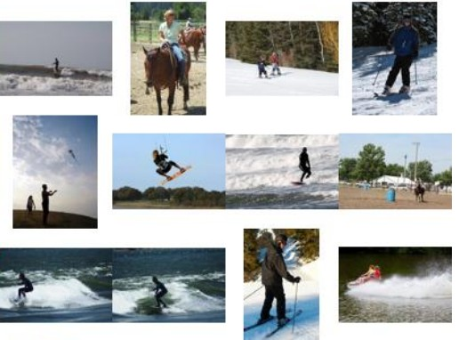

## 
<h1 align="center">Explaining How Visual, Textual and Multimodal Encoders Share Concepts</h1>

<div align="center">
<a href="https://github.com/ClementCornet/">Clément Cornet</a>,
<a href="https://scholar.google.com/citations?hl=fr&user=9CiniHsAAAAJ">Romaric Besançon</a>,
<a href="https://hleborgne.github.io/">Hervé Le Borgne</a>,
<br>
<br>

[](https://arxiv.org/abs/2507.18512)
</div>

<h3 align="center">Abstract</h3>

<p align="justify">
Sparse autoencoders (SAEs) have emerged as a powerful technique for extracting human-interpretable features from neural networks activations. Previous works compared different models based on SAE-derived features but those comparisons have been restricted to models within the same modality. We propose a novel indicator allowing quantitative comparison of models across SAE features, and use it to conduct a comparative study of visual, textual and multimodal encoders. We also propose to quantify the Comparative Sharedness of individual features between different classes of models. With these two new tools, we conduct several studies on 21 encoders of the three types, with two significantly different sizes, and considering generalist and domain specific datasets. The results allow to revisit previous studies at the light of encoders trained in a multimodal context and to quantify to which extent all these models share some representations or features. They also suggest that visual features that are specific to VLMs among vision encoders are shared with text encoders, highlighting the impact of text pretraining.
</p>
<br>
<div align="center">
    

</div>
<p class="center2">
Some of the 100 images corresponding to the highest activations of the feature associated to the verb "to ride" for the CLIP's visual encoder
</p>

---
### Setup
On Linux, using [uv](https://docs.astral.sh/uv/), create an environnment from `pyproject.toml`.

```bash
uv sync
source .venv/bin/activate
```

### Train Sparse Autoencoders and record features

Run `train_image.py` and `train_text.py` to train SAEs. 

```bash
uv run train_image.py \
        --model ClipVision \ # As defined in `wrappedmodels.py`
        --clip_model_name ViT-B/32-quickgelu \ # Model ID (OpenClip/HF/Torch Hub)
        --layers 0 1 2 3 4 5 6 7 8 9 10 11 \ # By default, only last layer          
        --runname clipvision_coco

uv run train_text.py  --model ClipText \
        --clip_model_name ViT-B/32-quickgelu \
        --layers 0 1 2 3 4 5 6 7 8 9 10 11 \ 
        --runname cliptext_coco
```

Features are saved to disk, at `./sae_features/<runname>`.


All models are by default at L size. For both scripts, `--<model>_model_name` to change the size.
Details of arguments to pass to use the same models as in the paper, for image encoders :

| Model   | Size | Args                                                                        |
| ------- | ---- | --------------------------------------------------------------------------- |
| CLIP    | B    | --model ClipVision --clip_model_name ViT-B/32-quickgelu                     |
| CLIP    | L    | --model ClipVision --clip_model_name ViT-L/14-quickgelu                     |
| DFN     | B    | --model ClipVision --clip_model_name hf-hub:apple/DFN2B-CLIP-ViT-B-16       |
| DFN     | L    | --model ClipVision --clip_model_name hf-hub:apple/DFN2B-CLIP-ViT-L-14       |
| SigLIP2 | B    | --model SigLIP2Vision --siglip2_model_name google/siglip2-base-patch16-224  |
| SigLIP2 | L    | --model SigLIP2Vision --siglip2_model_name google/siglip2-large-patch16-384 |
| ViT     | B    | --model ViT --vit_model_name google/vit-base-patch16-224                    |
| ViT     | L    | --model ViT --vit_model_name google/vit-large-patch16-384                   |
| DinoV2  | B    | --model DinoV2 --dino_model_name dinov2_vitb14                              |
| DinoV2  | L    | --model DinoV2 --dino_model_name dinov2_vitl14                              |

Details of arguments to pass to use the same models as in the paper, for text encoders :

| Model   | Size | Args                                                                     |
| ------- | ---- | ------------------------------------------------------------------------ |
| CLIP    | B    | --model ClipText --clip_model_name ViT-B/32-quickgelu                    |
| CLIP    | L    | --model ClipText --clip_model_name ViT-B/32-quickgelu                    |
| DFN     | B    | --model ClipText --clip_model_name hf-hub:apple/DFN2B-CLIP-ViT-B-16      |
| DFN     | L    | --model ClipText --clip_model_name hf-hub:apple/DFN2B-CLIP-ViT-L-14      |
| SigLIP2 | B    | --model SiglipText --siglip2_model_name google/siglip2-base-patch16-224  |
| SigLIP2 | L    | --model SiglipText --siglip2_model_name google/siglip2-large-patch16-384 |
| BERT    | B    | --model Bert --bert_model_name bert-base-uncased                         |
| BERT    | L    | --model Bert --bert_model_name bert-large-uncased                        |
| DeBERTa | B    | --model Deberta --deberta_model_name microsoft/deberta-base               |
| DeBERTa | L    | --model Deberta --deberta_model_name microsoft/deberta-large              |


### wMPPC

Quantitative comparaison of models upon SAE-derived features. 
After recording SAE features, compute $\textit{wMPPC}^{A \rightarrow B}$ with :

```bash
uv run wmppc.py --source A --target B
```

Where $A$ and $B$ correspond to `--runname` used at SAE training time.


### Comparative Sharedness

Compute (Generalized) Comparative Sharedness of individual features $\Delta^{M \rightarrow G,H}$. Get features of $M$ that are better shared with every model of $G$ than with any model of $H$.

```bash
uv run comp_sharedness.py \
        --source clip \ # M
        --min_group siglip dfn \ # G
        --max_group vit dino # H
```

### Save feature previews

Show 9 highest activations of each feature for a given run

```bash
uv run show.py --run clip
```

### Citation
```bibtex
@article{cornet2025explaining,
  title={Explaining How Visual, Textual and Multimodal Encoders Share Concepts}, 
  author={Cornet, Cl{\'e}ment and  Besan\c{c}on, Romaric and Le Borgne, Herv{\'e}},
  journal={arXiv preprint arXiv:2507.18512},
  year={2025}
}
```
